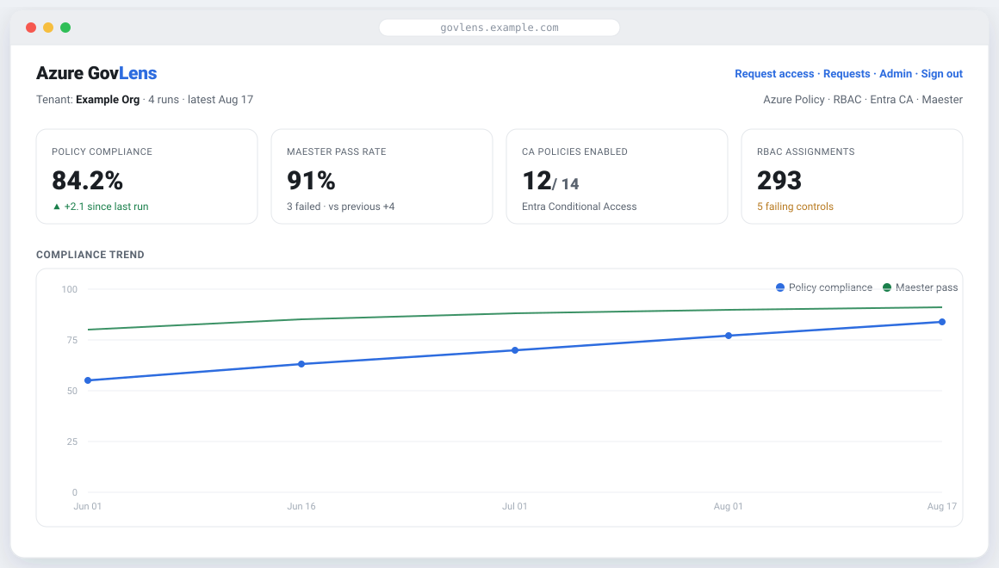

<div align="center">

# GovLens

**Lean Azure &amp; Entra governance, plus reviewed self-service access.**

Continuous visibility into your Azure Policy compliance, RBAC, and Conditional Access,
with a guided **request → approve → auto-expire** workflow for granting and revoking access safely.

[](https://github.com/automationpi/govlens/actions/workflows/ci.yml)
[](https://github.com/automationpi/govlens/actions/workflows/release.yml)
[](LICENSE)
[](https://github.com/automationpi/govlens/pkgs/container/govlens)
[](go.mod)
[](https://automationpi.github.io/govlens/)

<br>

<a href="https://automationpi.github.io/govlens/"></a>

**[📖 Documentation](https://automationpi.github.io/govlens/)**  ·  [User Guide](https://automationpi.github.io/govlens/)  ·  [Operator Guide](https://automationpi.github.io/govlens/operator.html)

<sub>Dashboard shown with example data.</sub>

</div>

---

GovLens is the leanest access-governance option for a small-to-mid Microsoft cloud tenant:
**one container, your own database, three least-privilege service principals.** No PowerShell, no
heavyweight tooling; a single Go binary talks directly to the Azure ARM and Microsoft Graph REST APIs.

## Why GovLens

Small and mid-size teams increasingly have to **prove** access governance. SOC 2 and ISO 27001
(Annex A 5.18) both require you to review who has access to what on a recurring basis (quarterly for
standard access, more often for privileged), enforce least privilege, revoke access promptly when
people change roles or leave, and hand an auditor **documented evidence** that it happened.

Azure works against you here: roles get granted and rarely removed, so standing permissions and
**privilege creep** pile up between reviews. Governance is an ongoing operational rhythm, not a
once-a-year scramble.

The tooling to do this well isn't built for a small org:

- **Microsoft-native (Entra ID Governance).** PIM, access reviews, and entitlement management need
  Entra ID **P2 (about $10/user/month)** plus the **Governance add-on (about +$7/user/month)**, billed
  per seat, indefinitely. For a 50-person team that is roughly **$10,000/year for access governance
  alone**, scaling linearly as you grow.
- **Enterprise IGA (SailPoint, Saviynt, Okta).** Capable, but heavy to deploy and priced for large
  enterprises. Overkill for a lean team.
- **Free point tools (AzGovViz, Maester, EntraExporter).** Good for a one-time snapshot, but they
  produce static reports: no trend over time, no drift detection, no request/approval workflow, and no
  audit trail. You end up gluing scripts together and still can't show an auditor a clean history.

**GovLens is built for the org in the middle.** One small container against your own Postgres, **no
per-seat licensing**, and a footprint a single admin can run:

- Continuous **visibility** (policy compliance, RBAC, Conditional Access) with **trends and drift**, so
  privilege creep is caught between reviews.
- **Self-service access** that is time-bound and approval-driven (the just-in-time model auditors
  favor), with **automatic expiry** so access doesn't linger.
- A complete **audit trail** of who requested, who approved, what was provisioned, and when it expired
  or was removed, which is exactly the evidence SOC 2 and ISO 27001 reviewers ask for.
- **Least privilege by design**: narrow scopes, short durations, and three separated, least-privilege
  service principals.

If you are a small team that needs real access governance for compliance but can't justify per-user
governance licensing or an enterprise IGA rollout, that is the gap GovLens fills.

## What it does

**📊 Governance visibility**: a read-only collector regularly snapshots your tenant and shows it on a dashboard:
- Azure **Policy compliance** % and **Maester** pass rate, trended over time
- **RBAC** role assignments and **Conditional Access** coverage
- **Drift**: what access was added/removed between runs (with false-removals suppressed)
- Top **failing controls** by severity

**🔑 Reviewed access lifecycle**: a guided self-service workflow, least-privilege by design:
- Users **request** access from a 4-step wizard (where → how much → how long → why) that hides Azure's
  hundreds of roles behind plain **Read-only / Contribute / Admin** levels
- Approvers **review** and set an expiry; grants are **time-bound and auto-revoked** by default
- Revoking existing access follows the same **mark → approve → execute** flow
- A full **audit trail** of who requested, approved, provisioned, and expired every grant

## Quickstart

```bash
# 1) Configure: copy the sample and fill in your DB, auth, and service principals
cp config.example.yaml config.yaml && $EDITOR config.yaml

# 2) Run: one container against your own Postgres
docker run -d --name govlens \
  -v ./config.yaml:/etc/govlens/config.yaml:ro \
  -p 8080:8080 \
  ghcr.io/automationpi/govlens:latest

# → open http://localhost:8080
```

GovLens creates its own schema on first start, then supervises the web app and the enabled workers.
Any config value may use `${ENV_VAR}` so secrets stay in the environment. See
**[`config.example.yaml`](config.example.yaml)** and **[docs/DEPLOY.md](docs/DEPLOY.md)** for the full reference.

## Architecture

One image, your database, three separated credentials, so no single component can both read broadly
and change access. **The web app holds no Azure credential.**

| Component | Credential | Does |
|---|---|---|
| **Web** | none | Serves the UI; only reads/writes the request queue |
| **Collector** | read-only SP | Pulls governance data → stores a run |
| **Remediator** | roles-only SP (**delete**) | Executes approved revokes + grant expiry |
| **Grant worker** | roles-only SP (**write**) | Provisions approved grants; self-verifies each cycle |

Each service principal authenticates with a **certificate or a client secret**: your choice.

## Documentation

- 📘 **[User Guide](https://automationpi.github.io/govlens/)**: requesting access, approvals, the dashboard, the Requests hub
- 🛠️ **[Operator Guide](https://automationpi.github.io/govlens/operator.html)**: provisioning the SPs, config reference, running, hardening, troubleshooting
- 🚀 **[Deployment](docs/DEPLOY.md)**: the single-image, config-driven deploy
- 🏛️ **[Architecture](docs/ARCHITECTURE.md)** · **[Self-service grant design](docs/SELF-SERVICE-GRANT.md)**

## Security model

- **Separated credentials**: read-only / delete-only / write-only; least-privilege custom roles
- **Fail-closed everywhere**: self-service won't go live until every enablement gate is green;
  unknown roles are treated as privileged; a stale SP verification closes the module
- **Time-bound by default**: grants expire and are auto-revoked; "permanent" is a policy-gated exception
- **Bring your own database**: GovLens never manages one; point it at your Postgres via a connection string

## Development

```bash
docker compose up -d          # local Postgres + web + workers (dev stack)
# http://localhost:8080

go build ./... && go test ./...
```

The dev `docker-compose.yml` runs each component separately (overriding the image's `govlensd` launcher);
the published image runs the whole stack from one config file.

## License

[Apache-2.0](LICENSE).
